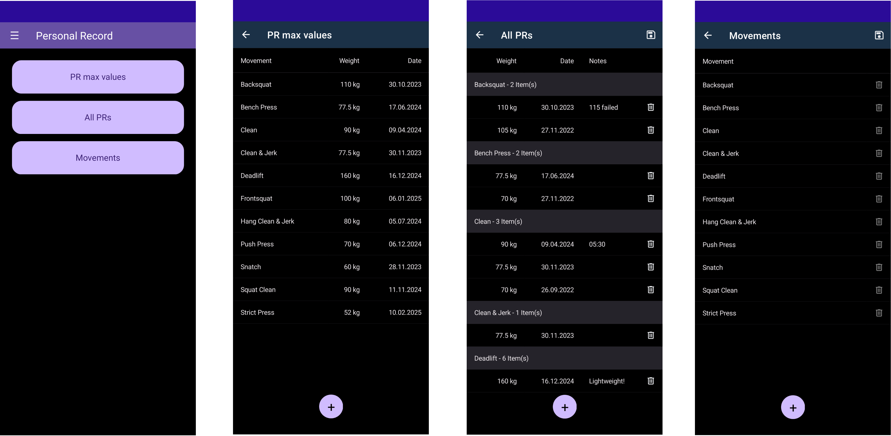
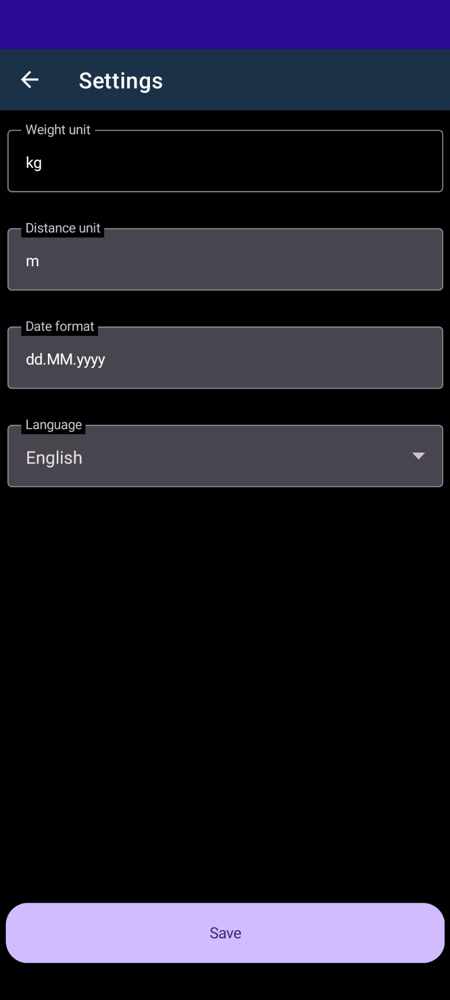

- [Description](#description)
- [Usage](#usage)
  - [Overview](#overview)
  - [Themes](#themes)
  - [Data and storage](#data-and-storage)
  - [Burger menu](#burger-menu)
  - [Movements](#movements)
  - [All movement records](#all-movement-records)
  - [Movement record maxes](#movement-record-maxes)
  - [Settings](#settings)
    - [Unit](#unit)
    - [Date format](#date-format)
    - [Language](#language)
- [Contribution](#contribution)
  - [Translations and languages](#translations-and-languages)
  - [Syncfusion](#syncfusion)
    - [Get a community license](#get-a-community-license)
  - [Development](#development)
  - [Contributors ✨](#contributors-)

# Description
With this app you can track all your personal records and have a good overview of your progress. Define your own movements and add the maximum values achieved. A feature for workouts will follow soon.

# Usage
## Overview

## Themes
There is a dark and a light theme, it is automatically adapted to the system theme.

## Data and storage
The settings are saved as preferences and the data in the app folder. This means that the data is transferred to the new device with a backup/restore. Synchronization between multiple devices is currently not supported.

## Burger menu
The burger button at the top left takes you to the settings, you can report a problem, go to the project page or switch to the page for sponsoring the project. You can also see the version here.

## Movements

To add movement records, you must first define your movements. By pressing the plus button, a new line is added in which you can name your movement. Movements can only be deleted, as long as they are not in use.

## All movement records

In this menu you can enter all your data records with a movement, the weight and a date. This is the overview to see them all, they are sorted by the name of the movement and then the most recent movements at the top. New entries can be added with the plus button and deleted with the recycle bin button.

## Movement record maxes

This is an overview screen in which all maximum values for the respective movement are displayed. New entries can also be added here.

## Settings

### Unit
The unit is a free text field and is only used for display purposes. No conversions take place when changing.

### Date format
You can use a format identifier to specify how your date format should be displayed. For example, yyyy-MM-dd (ISO 8601 Date Format) displays the date as follows: 2023-12-31. See the [standard date and time format specifiers](https://learn.microsoft.com/en-us/dotnet/standard/base-types/standard-date-and-time-format-strings#table-of-format-specifiers) here.

### Language
The language can be changed and will be applied directly after saving. New languages can be added, see also [translations and languages](#translations-and-languages) for more information.

# Contribution
Anyone is welcome to work on this project, for which a bug or a change request can be reported, texts translated, or code adjustments made directly and a pull request created. Please refer to the documentation for the respective topics you would like to contribute to.

## Translations and languages
This app can provide multiple languages and includes already the languages `English` and `German`. A new language can be added within a few steps, to do this, please check out the [documentation](./DEVELOPMENT.md#languages).

## Syncfusion
Syncfusion components are used in this project, therefore a community license is required for each developer. Please make sure that you never commit your license key.

### Get a community license
You can apply for a community license here: https://www.syncfusion.com/sales/communitylicense

## Development
Please read the [development documentation](./DEVELOPMENT.md) if you would like to participate in the development.

## Contributors ✨

<!-- ALL-CONTRIBUTORS-LIST:START - Do not remove or modify this section -->
<!-- prettier-ignore-start -->
<!-- markdownlint-disable -->
<table>
  <tbody>
    <tr>
      <td align="center" valign="top" width="14.28%"><a href="https://github.com/Ramo-Y"> <b>Ramazan Yilmaz</b></a> <a href="#code-Ramo-Y" title="Code">💻</a></td>
      <td align="center" valign="top" width="14.28%"><a href="https://allcontributors.org"> <b>All Contributors</b></a> <a href="#doc-all-contributors" title="Documentation">📖</a></td>
    </tr>
  </tbody>
</table>

<!-- markdownlint-restore -->
<!-- prettier-ignore-end -->

<!-- ALL-CONTRIBUTORS-LIST:END -->